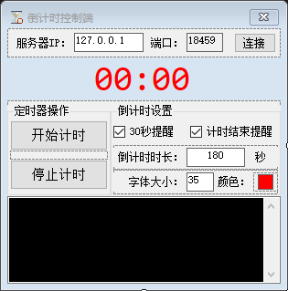

# 桌面倒计时软件

使用局域网Socket连接控制显示端显示一个倒计时, 并可以在控制端修改相关的内容设置

`开发平台`: VS2019

`开发技术`: C#, WinForm

`使用到的技术`: WinForm无边框, 透明背景, TCP通讯等

## 技术原理

使用Socket建立局域网的TCP连接, 并通过客户端与服务端之间的通信完成指定的功能

数据传输格式为字符串, 使用自定义的命令符, 由控制端控制客户端的一些行为

**主要指令解析部分如下**

```c#
switch (Command[0].ToUpper())
{
    case "RUN":
        开始计时ToolStripMenuItem_Click(null, null);
        break;
    case "STOP":
        停止计时ToolStripMenuItem_Click(null, null);
        break;
    case "TOTALTIME":
        TotalCount = new TimeSpan(0, 0, Convert.ToInt32(Command[1]));
        break;
    case "SHOWWARNING":
        ShowWarning = Convert.ToBoolean(Command[1]);
        break;
    case "SHOWSTOP":
        ShowStop = Convert.ToBoolean(Command[1]);
        break;
    case "FONTSIZE":
        lbCountDown.Font = new Font(lbCountDown.Font.FontFamily, Convert.ToInt16(Command[1]), FontStyle.Regular);
        break;
    case "FONTCOLOR":
        string[] C = Command[1].Split(',');
        int R = Convert.ToInt16(C[0]);
        int G = Convert.ToInt16(C[1]);
        int B = Convert.ToInt16(C[2]);
        lbCountDown.ForeColor = Color.FromArgb(R, G, B);
        if (R < 2) R += 1;
        else R -= 1;
        TransparencyKey = Color.FromArgb(R, G, B);
        BackColor = Color.FromArgb(R, G, B);
        break;
}
byte[] data = Encoding.ASCII.GetBytes(TMP + "\r\n");
```


## 显示端

显示端接受来自服务端的指令并执行相关的指令

显示端会每隔一段时间将当前的计时结果通过相同的指令格式传递给客户端, 客户端收到后会更新面板的状态, 由此可以判断两者之间的连接状况

**一旦客户端接收到指令, 会立即执行, 即时中途断网也不会影响到计时操作, 但是服务端将无法刷新实时状态**

**`显示端功能`**

根据目前的协议, 显示端可以由控制端控制字体大小, 颜色以及基础的计时功能, 同时可以设置计时时长与是否进行声音提醒

**`可开发功能`**:

通过定制更多的协议可以实现客户端的语音播报, 音乐播放, 声音控制等功能


## 控制端



通过18459端口与客户端建立连接, 这里需要注意的是需要指定服务端的IP

> 需要注意的是, 虽然这里叫做控制端, 实质上是TCP连接的客户端
> 该设计主要考虑到一个倒计时可以由多个控制端同时控制, 因此将显示端设置为TCP连接的服务端

由于使用TCP连接需要指定连接对象的IP地址, 因此可以考虑以下操作

> 1. TCP的服务端在启动时创建一个UDP的广播信号, 将服务端的IP与TCP连接的端口广播到局域网中
>
> 2. 控制端启动时监听特定端口的广播内容
> 3. 如果控制端监听到广播的内容, 则建立TCP连接, 并注销掉UDP的监听线程


## 其他

1. 客户端控制设备声音的方法已上传, 通过调用系统的API实现音量控制
2. 该程序于2018年7月编写, 2020年才开始写README, 很多地方不是很详细
3. 如果有疑问欢迎查看源码, 也可联系[作者](mailto:zzudongxiang@163.com)

